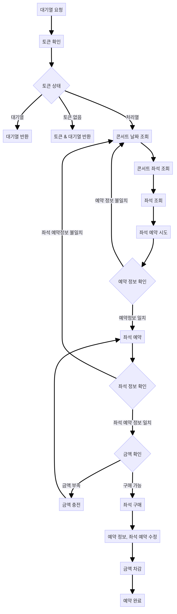

# hhplus-Concert
## 설계
### 시퀀스 다이어그램

  
그림

  

    
  

### 플로우 차트

  
그림

  

    
  

### ERD 다이어그램

  
그림

  

    
  

### API 문서
[API 문서](./apiBlueprint.md)

## 계획
### Milestone
[milestone](https://github.com/faulty337/hhplus-Concert/milestones)

## 이슈 및 문제 해결 방안
### 동시성 문제
[동시성문제](./concurrency.md)
- DB락, 분산락 별 정리 및 적용 문서

### 캐시
[캐시](./caching.md)
- Cache 정리

### 쿼리 최적화
[쿼리](./index.md)
- 전체 쿼리 파악 및 

### 서비스 분리 및 트랜잭션
[서비스 분리](./Service.md)

### 부하 테스트
[부하테스트](./loadTest.md)
- k6 이용 시나리오 테스트
