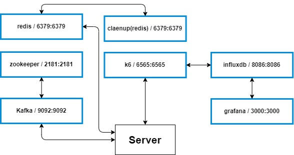
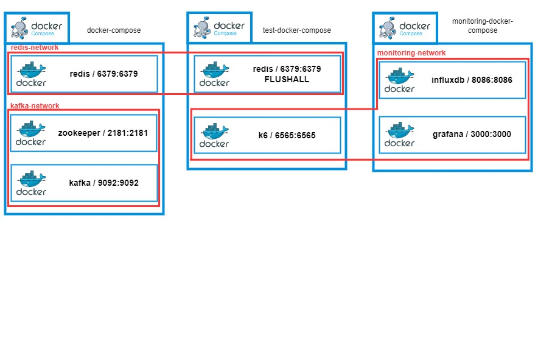

# docker network
docker network 정리
## docker compose 별 container
용도 별 docker compose를 분리했고 이에 따른 각 컨테이너에 대한 정리
### docekr-compose.yml (default)
server 가동시 필수적인 서비스 세팅
1. redis
    - 대기열, token, cache에 이용
2. kafka
    - 이벤트 드리븐용
3. zookeeper
    - kafka 필수

### monitoring-docker-compose.yml
모니터링을 위한 DB, UI에 대한 세팅
1. influxdb
    - 테스트 등에서 나오는 log나 데이터 저장용
2. grafana
    - 모니터링 UI

### test-docker-compose.yml
1. k6
    - 전체 서비스 이용을 가정한 테스트용
2. cleanup(redis)
    - test전 redis flushAll 용 service

## 컨테이너별 통신
각 컨테이너별 통신에 따른 구별

### kafka
- zookeeper
    - 기본 사용 아키텍처
- server
    - 서버의 이벤트 드리븐을 위한 통신

### redis
- server
    - in memory 이용을 윟나 통신
- cleanup(redis)
    - test이후 초기화 용

### k6
- server
    - 전체 서비스 부하 테스트 통신
- influxdb
    - 테스트 결과, log 등 저장을 위한 통신

### grafana
- influxdb
    - 모니터링하기 위한 데이터 통신

## Network 구성
용도별 Network 목록
1. redis-network
2. kafka-network
3. monitoring-network

## 최종 구성안

## docker compose file link
[docker](./concert/docker)
