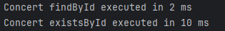

## 쿼리 파악

### 사용 쿼리
```jsx
//concert
concertJpaRepository.findById()
concertJpaRepository.existsById()

//concertSession
concertSessionJpaRepository.findAllByConcertId()
concertSessionJpaRepository.findByIdAndConcertId()
concertSessionJpaRepository.findByIdAndConcertIdAndOpen()

//concertSeat
seatJpaRepository.findById()
seatJpaRepository.findByIdAndSessionId()
seatJpaRepository.findAllBySessionId()

//reservation
reservationJpaRepository.findById()
reservationJpaRepository.findByIdAndUserId()
```

### 쿼리 부하 테스트
#### 쿼리 파악
해당 서비스에 대한 쿼리에 대해 부하를 줄 수 있는 요인은 크게 2가지가 있다.
1. 사용 빈도
    - concert -> concertSession -> concertSeat -> reservation
    - 서비스상 ConcertSession을 조회 한 다음에 좌석을 조회하고 좌석을 선택한 이후에 예약을 하기에 최악을 생각하더라도 위 순서대로 조회가 횟수가 많을 것이다.
        - 중복 쿼리가 없지만 만약 있더라도 각 기능에서 동일 쿼리를 여러번 조회하더라도 Transaction에 묶여 있기에 중복은 신경쓰지 않는다.

2. 슬로우 쿼리
    - 쿼리문 요청 이후 데이터 응답까지의 시간이 일정 시간 넘어갈 수 있는 쿼리를 말한다.
    - 주 원인으로는
        - 비효율적인 인덱스
            - 인덱스 처리가 되지 않은 데이터와 인덱스 된 데이터의 조회 효율은 차원이 다르다.
            - 이때 대량의 데이터에서 인덱스가 아닌 특정 조건에 의해서만 조회하게 될 시 Full Table Scan이 일어나 느려질 수 있다.
        - 무분별한 Join
            - 여러 테이블을 Join할 시에 Join되는 테이블에 대한 필터링, 정렬 등을 수행하게 된다.
            - 마찬가지로 인덱스 처리로 성능을 향상 시킬 수 있다.

그렇다면 각 쿼리에서 슬로우 쿼리 요소가 포함되는지에 대해 파악을 해야 한다. 
Index로 조회 하지 않는 쿼리를 모은다면
```sql
concertSessionJpaRepository.findAllByConcertId()
seatJpaRepository.findAllBySessionId()
```
이 두개의 쿼리가 있게 된다.

그렇다면 여기까지는 알고 있는 지식으로 슬로우 쿼리를 유추하고 추출한 것이며, 
실제 느린지에 대해서는 테스트해볼 필요가 있다고 판단했다.

#### 쿼리 테스트
당연할 수도 있지만 실제 느린지에 대해 테스트를 해보았고 테스트는 실제 데이터를 넣어 조회하는 방식으로 진행했다.

데이터는 Concert 10,000, Concert 마다 ConcertSession 10(100,000), ConcertSession마다 Seat, Reservation 50(5,000,000) 의 데이터를 집어넣었고 이를 기반으로 시간을 체크했다.


Concert - 약 1만

```jsx
concertJpaRepository.findById()
concertJpaRepository.existsById()
```



Session - 약 10만

```jsx
concertSessionJpaRepository.findAllByConcertId()
concertSessionJpaRepository.findByIdAndConcertId()
concertSessionJpaRepository.findByIdAndConcertIdAndOpen()
```


Seat - 약 500만

```jsx
seatJpaRepository.findById()
seatJpaRepository.findByIdAndSessionId()
seatJpaRepository.findAllBySessionId()
```


Reservation - 약 500만

```jsx
reservationJpaRepository.findById()
reservationJpaRepository.findByIdAndUserId()
```


`findById` 와 같은 Index 조회에 대한 쿼리는 보통 10ms 이내에 끝나게 된다.

하지만 index조회가 아닌 부분에서는 오래 걸리는 것을 볼 수 있다.

### Index 추가
- 위에서 실제로 느린 쿼리에 대해 파악했으며 이에 추가적인 처리가 필요하다.
- 그러나 그냥 냅다 Index를 꽂기 전에 생각을 해봐야 한다. Index는 그냥 등록하는게 아닌 Index 데이터 구조가 생기는 것으로 이를 유지하기 위한 추가 작업들이 생기게 된다. 따라서 해당 테이블에 대한 삽입, 삭제, 수정이 자주 발생하는 만큼 이에 대한 처리가 필요해지므로 대게 수정, 삽입이 자주 안 일어나는 테이블에 걸면 좋다.
- 하지만 현재 서비스상 시간일 갈 수록 Concert와 Session, Table이 계속해서 늘어나며 ConcertSession은 몰라도 Seat테이블의 수정과 조회의 비율의 최악의 경우 1:1이기 때문에 인덱스를 추가하는 것이 서비스상 더 효율적이라 판단했다.
- 일단 ConcertSession은 변경은 없으며 삽입과정만 있기 때문에 기존 Cache 적용되어 있으나 Cache도 결국 첫 조회자에 한해 느린 성능을 제공할 수밖에 없기 때문에 Index처리가 낫다고 판단했다.
- ConcertSeat은 State값이 있고 이는 예약후 변경되기 때문에 수정이 많이 일어나게 된다.

#### 추가 방법
1. Entity 추가 방법
    ```java
        @Table(name = "concert_seat", indexes = {
            @Index(name = "idx_concert_session_id", columnList = "concertSessionId")
        })
    ```

2. SQL 추가 방법
    ```java
        CREATE TABLE concert_seat (
            id BIGINT AUTO_INCREMENT PRIMARY KEY,
            seat_number INT NOT NULL,
            price INT NOT NULL,
            available BOOLEAN NOT NULL,
            concert_session_id BIGINT NOT NULL,
            version INT NOT NULL
        );

        CREATE INDEX idx_concert_session_id
        ON concert_seat (concert_session_id);
    ```

**ConcertSession**
- concertSession에서 추가한 Index는 ConcertId하나 뿐이다.
- 쿼리에서 조회는 ConcertId와 sessionTime을 이용한 Read이다. 하지만 SessionTime은 카디널리티가 높고 Concert마다 많더라도 50개 정도의 ConcertSession가 생기는데 이 데이터에 Full Table Scan이 일어나더라도 큰 딜레이가 없을것이라 예상되기에 따로 넣지 않았다.
- 수정) Session 정보는 수시로 추가되는 정보가 아니기에 삽입, 수정의 요청이 거의 없다. 즉, Index 테이블에 대한 부하가 크기 않으므로, ConcertId와 SessionTime 두개로 Index를 걸어도 괜찮다.


#### 추가 결과
Index 추가 전


Index 추가 후


