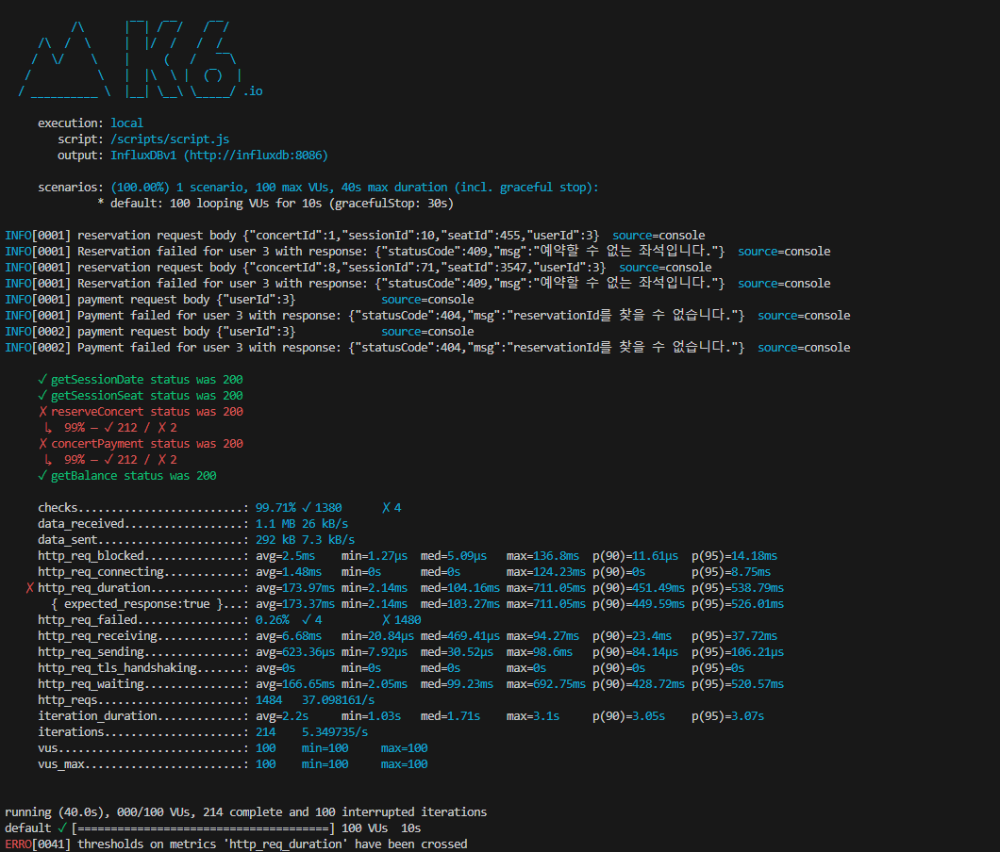

# 부하 테스트

## **API 구조**

1. `concert/waiting/status` 대기열 정보 조회
    - 대기열 정보를 조회하고 만약 처리열 상태면 process가 true를 반환
    - 따로 DB에 접근하지 않기 때문에 transaction을 사용하지 않는다.
2. `concert/{concertId}/session` 콘서트에 해당하는 세션 조회
    - 요청 콘서트ID에 따른 열리는 날에 대한 Session 정보를 반환
3. `concert/{concertId}/seat` 콘서트와 sessionId에 따른 좌석 정보 조회
    - 좌석은 예약 가능 여부를 isAvailable를 통해 표시
4. `concert/reservation` 콘서트 예약
    - 위 조회를 통한 콘서트, 세션, 좌석 ID를 기반으로 예약 요청
5. `concert/payment` 예약 결제
    - 예약에 대한 결제
6. `concert/balance` 잔액 조회
    - User의 잔액 확인

## **테스트 방법**

### 1. 테스트 방법

- 약 100명의 유저가 10초간 서비스를 지속적으로 요청 한다고 가정
- 서비스의 경우 실제 서비스와 같이 `대기열 등록 -> 콘서트 조회(세션, 좌석) -> 콘서트 예약 -> 결제 -> 잔액 확인` 과 같이 진행된다.

```jsx

    let concertId = randomIntBetween(1, 10);
    let userId = randomIntBetween(1, 10);

		//대기열 발급
    let waitingResponse = http.get(`${BASE_URL}/concert/waiting/status?userId=${userId}`)
    check(waitingResponse, { 'getSessionDate status was 200': (r) => r.status === 200 });
    let waitinginfo = JSON.parse(waitingResponse.body);
    while(!waitinginfo.processing){
        waitingResponse = http.get(`${BASE_URL}/concert/waiting/status?userId=${userId}`)
        waitinginfo = JSON.parse(waitingResponse.body);
        sleep(1000)
    }

    let token = waitinginfo.token
		
		//콘서트 세션 정보 조회
    let sessionResponse = http.get(`${BASE_URL}/concert/${concertId}/session`);
    check(sessionResponse, { 'getSessionDate status was 200': (r) => r.status === 200 });

    let sessions = JSON.parse(sessionResponse.body);
    let sessionId
    if (sessions.length > 0) {
        let randomIndex = Math.floor(Math.random() * sessions.length);
        sessionId = sessions[randomIndex].sessionId;
    } else {
        console.log('No sessions available');
        return;
    }

    // 2. 특정 세션의 좌석 정보 조회
    let seatResponse = http.get(`${BASE_URL}/concert/${concertId}/seat?sessionId=${sessionId}`);
    check(seatResponse, { 'getSessionSeat status was 200': (r) => r.status === 200 });

    let seats = JSON.parse(seatResponse.body).seatList;

    let seatId = getRandomAvailableSeat(seats);

    // 3. 예약 요청
    let reservationPayload = JSON.stringify({
        concertId: concertId,
        sessionId: sessionId,
        seatId: seatId,
        userId: userId
    });

    let reservationResponse = http.post(`${BASE_URL}/concert/reservation`, reservationPayload, {
        headers: {
            'Content-Type': 'application/json',
            'AuthorizationWaiting': `Bearer ${token}`
        },
    });

    let reservationSuccess = check(reservationResponse, { 'reserveConcert status was 200': (r) => r.status === 200 });
    if (!reservationSuccess) {
        console.log('reservation request body', reservationPayload)
        console.log(`Reservation failed for user ${userId} with response: ${reservationResponse.body}`);
    }
    let reservationId = JSON.parse(reservationResponse.body).reservationId;

    // 4. 결제 요청
    let paymentPayload = JSON.stringify({
        userId: userId,
        reservationId: reservationId
    });

    let paymentResponse = http.post(`${BASE_URL}/concert/payment`, paymentPayload, {
        headers: {
            'Content-Type': 'application/json',
            'AuthorizationWaiting': `Bearer ${token}`
        },

    });
    let paymentSuccess = check(paymentResponse, { 'concertPayment status was 200': (r) => r.status === 200 });
    if (!paymentSuccess) {
        console.log('payment request body', paymentPayload)
        console.log(`Payment failed for user ${userId} with response: ${paymentResponse.body}`);
    }

    // 5. 잔액 확인 요청
    let balanceResponse = http.get(`${BASE_URL}/concert/balance?userId=${userId}`);
    check(balanceResponse, { 'getBalance status was 200': (r) => r.status === 200 });

```

- 콘서트에 대한 예약과 결제에 사용되는 모든 로직을 하나의 서비스로 판단 했다.
- 즉, **유저가 실제로 콘서트를 예약하고 결제하기 위한 요청을 날렸고 이에 대한 처리를 가정하기 위해 하나의 서비스에 사용되는 로직을 전부 집어 넣었다.**

### 2. 테스트 목표

- TPS(Transactions Per Second)
    - 현재 대기열에서 동시 처리 가능 인원을 30으로 두었다.
    - 한번에 서비스 이용에서 사용되는 API는 6개, 여기서 Transaction을 사용하는 API는 5개이다.
    - 사용자가 서비스를 적게 잡아 30초 안에 처리한다고 가정한다.
    - TPS  = (5 * 30) / 30 = 5 이다.
    - 이는 서비스 운영에 있어서 30으로 잡았을 때에 최소 요구 TPS이며 동시 처리 인원에 따라 올라가야 한다.
- 응답 시간
    - 전체 평균 응답시간: 200ms
    - 95% 이내 요청 최소 응답 시간 : 300ms
    - 최대 응답 시간 : 500ms
    
    ```jsx
    http_req_duration: ['avg<200', 'p(95)<300', 'max<500'],
    ```
    
- 성공률
    - 95% 이하

### 3. 테스트 결과



- TPS
    - 사진과 같이 약 40초 동안 총 서비스 호출 횟수는 214개, 평균 210정도 되었다.
        - 총 요청 수는 1484 이지만 이는 `대기열 요청 - 대기` 를 포함한 요청이며, 대기열 요청은 Transaction을 사용하지 않기 때문에 사용한 API로 계산한다.
    - 총 요청수 : 210 * 5(Transaction 사용 API) = 1050
    - 실 TPS : 1050 / 40 = 26.25
    - 약 26 TPS가 된다.
- 응답 시간
    - 평균 응답 시간은 173.97ms 로 통과이다.
    - 95%의 요청에 응답 시간은 538ms 로 기준인 300ms를 초과했다.
    - 최대 응답시간은 711.05ms 로 500ms를 초과 했다.
- 성공률
    - 성공률은 약 99% 로 기준에는 합격했으나 실패 한 부분이 존재한다.

### 결과 분석

- TPS
    - TPS는 최소 기준치인 5를 넘기기는 했다. 그러나 예상 TPS보다 높게 나타나고 있다.
    - 이는 한 서비스에서 소비되는 시간을 30초로 잡은 부분이 반영이 안된 부분이다. 해당 코드에서는 10초 중에 계속해서 요청을 하기에 잡을 수 있는 최대 TPS였다.
    - 최소치는 넘겼으나, 이후 동시에 처리할 트래픽, 서버 성능에 따라 조절이 필요하다.
- 응답 시간
    - 평균 응답 시간은 적절하지만 최대 응답 시간과 대부분의 응답 시간이 기준치를 초과 했다.
    - 해당 부분은 예약과 결제에서 초과되었던 부분이다.
        - 대부분 Insert, Update에서 일어난 부분으로 Select보다 미세하지만 느리긴 하다.
        - 예약과 결제에서 각 요청에 대해 유효성 체크를 한다. 즉, Concert, Session, Seat에 대한 모든 조회를 진행하고 Insert를 하게 되므로 예약과 결제에 대한 처리가 늦을 수 밖에 없다.
            - 각 조회에 대한 쿼리문 확인
                - 전체 인덱스 이용 조회 확인
        - Reservation, 혹은 불필요한 유효성 체크를 제외 필요
- 성공률
    - 실패 원인은 동시성 문제로 동시에 처리된 좌석에 대해 무결성 보장을 위해 강제로 실패 처리로 진행하며 약 2개의 동시성 문제를 일으켰고 이에 대한 처리로 인해 실패 처리가 되었다.
    - 동시성에 대한 실패는 정상 로직에 대한 반응이므로 이외에 다른 실패가 없어 성공률은 적절하다고 판단했다.

### 장애 대응

1. 장애 인지
    - 기본적으로 HealthCheck를 통한 서버의 생존 유무에 따른 이벤트 발생 알람 발생
2. 초기 대응
    - 로그 백업
        - 복구 불가능 상태에 대비를 위한 Log파일 상태 확인 및 데이터 백업
    - 긴급 복구
        - 서비스 중단일 경우 시스템 재부팅, 이전 버전 롤백을 통한 복구 작업 진행
    - 정상 복구
        - 문제 원인을 제거하고 정상 상태로 다시 복구 작업 진행
    - 복구 확인
        - 서비스 동작 확인하여 서비스가 제대로 제공되고 있는지 확인
3. 장애 보고 및 문서화
    - 장애 발생 시간, 영향 규모, 장애 원인, 복구 방법 등에 대한 문서화 진행
        - 문서의 경우 개발자만 보는 것이 아니기에 비 개발자를 위한 장애 상황 문서 작성 필요
4. 사후 분석 및 재발 방지
    - 로그 및 당시 데이터에 대한 코드 리뷰 및, 상태 점검 등을 통한 원인 분석
    - 분석된 원인에 대한 재발 방지 대책 수립
5. 테스트 및 장애 대응 훈련
    1.